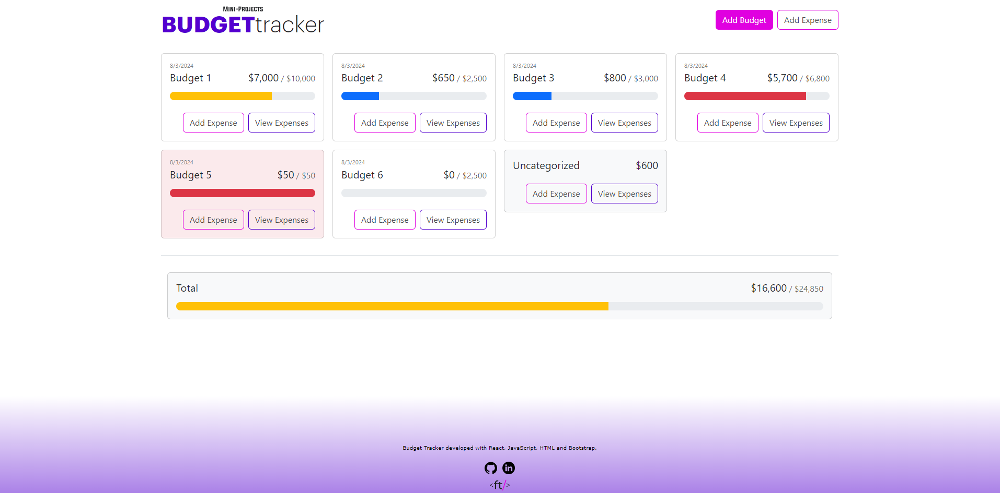

# Budget Tracker

## About this project

This is a project part of my Mini-Projects collection, made with React, JavaScript, HTML and Bootstrap.

Budget Tracker is an app where you can keep track of your budgets and expenses. You can create new budgets, add expenses to specific budgets or just add them to an uncategorized category, delete budgets and/or expenses, and keep track of your total expenses.

## Screenshots

## Deploy

[Weather App](https://ftbudgettracker.vercel.app/)